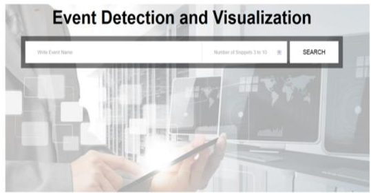
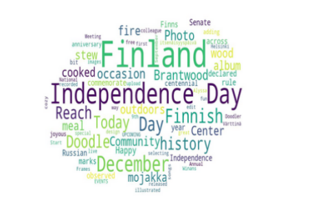
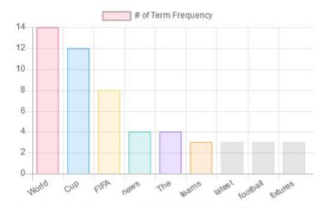

# Event detection in Twitter
Tracking events using social media analytics and news paper APIs




## Installation
Use the package manager [pip](https://pip.pypa.io/en/stable/) to install packages

## Usage
for example, install numpy library using pip
```bash
pip install numpy
```
## Description
1. A new idea for event detection and tracking through a selection of appropriate features.  
2. Topic detection and analysis using selected list of extracted concepts. 
3. Visualization toolkit to test and evaluate the performance of the detected event

## Programming language, libraries and APIs
- python 3, Flask framework
- nlp
- nltk
- scipy, numpy
- spacy
- word2vec
- scikit-learn
- LDA
- Google search API / Bing search API
- twitter streaming APIs, twitter lookup API, twitter trending API
